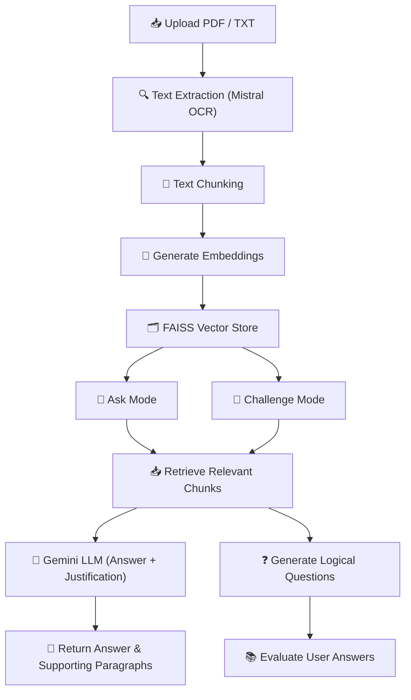

<h1 align="center">🧠 GenAI Research Assistant</h1>

  A beautifully designed AI assistant to summarize research papers, answer context-based questions, and challenge users with logic-based quizzes.

  
  

## 📸 Overview of the App

  

## 🎬 Live Demo

  

> 🔗 Click the image above to watch a 2–3 min walkthrough video hosted on Google Drive.

## ✨ Features

- 📄 **Auto-Summarization**: Instantly generates a ~150-word summary on upload  
- 💬 **Ask Anything**: Ask deep questions with AI-generated answers + highlighted justifications  
- 🧠 **Challenge Me**: Test yourself with logic-based AI questions and get smart feedback  
- 🎨 **Elegant UI**: Animated, gradient-rich, and cleanly styled layout  
- 🔄 **Switch Seamlessly**: Switch modes without losing your session data  

## 🧠 Architecture Overview

## 🖼️ Screenshots

### 📥 Upload Document + Auto-Summary

  

### 💬 Ask Anything with Justified Answer

  

### 🧠 Challenge Me: Logic-Based Questions

  

### 🧠 Challenge Me: AI Feedback

  

  

### 🧠 Challenge Me: AI Feedback

  

## 🚀 Getting Started
## Follow the steps below to run the project locally:

# 1️⃣ Clone the Repository
git clone https://github.com/Archit-1233/Ez_Labs_Data_Science_Assignment.git

# 2️⃣ Install all dependencies
pip install -r requirements.txt

# 3️⃣ Launch the Streamlit App
streamlit run app.py

## 🔐  Environment Variables
GOOGLE_API_KEY=your_api_key_here
MISTRAL_API_KEY =your_api_key_here

## 🧠 Final Notes
This project demonstrates how GenAI can be used to enhance document understanding, combining Mistral OCR, FAISS, Gemini LLM, and an interactive UI.
Designed with both aesthetics and learning experience in mind, making it useful for researchers, students, and AI enthusiasts.
Open to suggestions, improvements, and contributions!

## 🙌 Acknowledgements
🔮 Gemini LLM for generative question-answering
📚 FAISS for efficient vector similarity search
🎨 Streamlit for beautiful and reactive UI
🧠 Mistral OCR for accurate text extraction (custom integration)

## 📬 Connect with Me
Feel free to reach out if you'd like to collaborate or learn more:
✉️ Email: agrawalarchit121@gmail.com

