<h1 align="center">🧠 GenAI Research Assistant</h1>

  A beautifully designed AI assistant to summarize research papers, answer context-based questions, and challenge users with logic-based quizzes.

  
  

## 📸 Overview of the App

  

## 🎬 Live Demo

  

> 🔗 Click the image above to watch a 2–3 min walkthrough video hosted on Google Drive.

## ✨ Features

- 📄 **Auto-Summarization**: Instantly generates a ~150-word summary on upload  
- 💬 **Ask Anything**: Ask deep questions with AI-generated answers + highlighted justifications  
- 🧠 **Challenge Me**: Test yourself with logic-based AI questions and get smart feedback  
- 🎨 **Elegant UI**: Animated, gradient-rich, and cleanly styled layout  
- 🔄 **Switch Seamlessly**: Switch modes without losing your session data  

## 🧠 Architecture Overview

```mermaid
flowchart TD
    Upload["📥 Upload PDF / TXT"] --> OCR["🔍 Text Extraction (Mistral OCR)"]
    OCR --> Chunk["🧩 Text Chunking"]
    Chunk --> Embed["📐 Generate Embeddings"]
    Embed --> VectorDB["🗂️ FAISS Vector Store"]

    VectorDB --> AskMode["💬 Ask Mode"]
    VectorDB --> ChallengeMode["🧠 Challenge Mode"]

    AskMode --> Retrieval["📥 Retrieve Relevant Chunks"]
    Retrieval --> Gemini["🔮 Gemini LLM (Answer + Justification)"]
    Gemini --> Answer["📑 Return Answer & Supporting Paragraphs"]

    ChallengeMode --> Retrieval
    Retrieval --> QAgen["❓ Generate Logical Questions"]
    QAgen --> Eval["📚 Evaluate User Answers"]
```

## 🖼️ Screenshots

### 📥 Upload Document + Auto-Summary

  

### 💬 Ask Anything with Justified Answer

  

### 🧠 Challenge Me: Logic-Based Questions

  

### 🧠 Challenge Me: AI Feedback

  

  

### 🧠 Challenge Me: AI Feedback

  

